## Human–AI Setting in [Critical]{.accent} Situation

::: {.columns}
::: {.column width="47%"}

::: {.hook}
Operators must locate and recover people while conditions change quickly.
:::

- Missions occur in **challenging environments**
- Decisions must be made under **time pressure**
- Need [**reliable partner**]{.accent} to help humans [^1^](#references){style="color:#ec672c; text-decoration:none;"}

:::
::: {.column width="53%"}
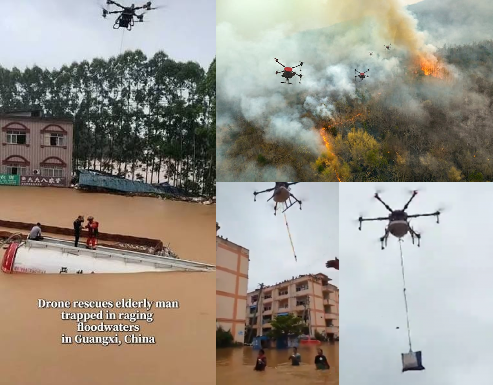{fig-alt="Drones supporting search-and-rescue operations" width="100%"}

:::
:::

---

## Research Questions and [Contribution]{.accent}

::: {.columns}
::: {.column width="42%"}

- **Performance:** Does LLM guidance improve task outcomes?
- **Attention:** How does guidance change visual attention and eye-tracking metrics?
- **Expertise:** Does expertise moderate these effects?
- **Testbed:** A controlled simulation supports repeatable human–AI teaming research.

:::
::: {.column width="40%" .center-v}
{fig-alt="Participant using an eye tracker while playing the search-and-rescue game" width="70%"}
:::
:::

::: {.card}
We study how humans and AI **process information together**, using **eye tracking** to inform **adaptive AI** for the future.
:::

---

## Study Design In [Brief]{.accent}

::: {.columns}
::: {.column width="56%"}
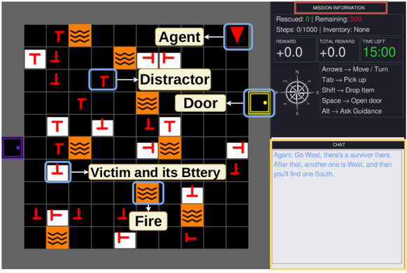{fig-alt="Search-and-rescue simulation interface with annotated game elements" width="100%"}
:::
::: {.column width="44%"}

::: {.stats .grid-2}
::: {.stat}
[13]{.stat-number}
[Participants]{.stat-label}
:::
::: {.stat}
[3]{.stat-number}
[Trials each (randomized)]{.stat-label}
:::
::: {.stat}
[2 + 1]{.stat-number}
[LLM + baseline]{.stat-label}
:::
::: {.stat}
[15 min]{.stat-number}
[or 1,000 moves]{.stat-label}
:::
:::

**Task:** rescue victims efficiently in a partially observable grid while victim health deteriorates.

**ALT** requests advice and reveals victim health for **5 seconds**.
:::
:::

---

## [Game]{.accent} Play {id="Game Play"}

<video controls width="90%" style="display:block; margin:auto; max-height:70vh;">
  <source src="assets/Mediaa.mp4" type="video/mp4">
</video>

---

## [Expertise Level]{.accent} {id="Expertise Level"}

```{=html}
<div style="display:flex; gap:32px; align-items:stretch; justify-content:center;">
<div style="flex:1; min-width:0; display:flex; align-items:center; justify-content:center;">
<video controls style="display:block; width:100%; height:480px; object-fit:contain;">
  <source src="assets/Media%201%20(1).mp4" type="video/mp4">
</video>
</div>
<div style="flex:1; min-width:0; display:flex; align-items:center; justify-content:center;">
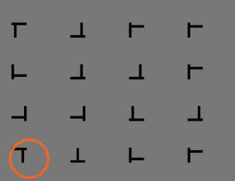
</div>
</div>
```

- **Expertise labeling:** K-means clustering (K = 2) grouped participants into expert vs. novice [^2^](#references){style="color:#ec672c; text-decoration:none;"}

---

## How The LLM Was [Prompted]{.accent} {.prompt-slide}

::: {.prompt-cubes}
::: {.prompt-cube data-category="style"}
[Guidance Style]{.card-title}

- You are a search-and-rescue coordinator giving calm, human-like radio guidance to the operator.
- Instructions must be directional and action-focused, always using North, South, East, West, with no coordinates, step counts, or visible reasoning.
- Output either a sparse one-sentence instruction or a detailed 3–4 sentence radio briefing, always concise, natural, and wrapped strictly as \<START\> ... \<END\>.
:::
::: {.prompt-cube data-category="priority"}
[Priority]{.card-title}

- Prioritize visible reachable survivors who are still saveable, nearest first.
- From the current state {obs}, choose one immediate objective by prioritizing the nearest reachable visible saveable survivor, then the next saveable survivor if relevant.
- Otherwise choose the best remaining alive victim, then the nearest reachable survivor or key, or finally explore visible areas that may open a new path.
:::
::: {.prompt-cube data-category="rules"}
[Mission Rules]{.card-title}

- Follow mission and environment rules: rescue all survivors.
- Use matching keys for locked doors, unlocked doors can be opened, carry only one key, avoid lava.
- Never mention unreachable objects. Final instruction must be rule-compliant.
:::
:::

- **Grid-based world:** each cell represents an object such as empty space, wall, victim, lava, door, or key. [^3^](#references){style="color:#ec672c; text-decoration:none;"}
- **Reachability check:** BFS determines which targets are reachable and their distance from the player. [^4^](#references){style="color:#ec672c; text-decoration:none;"}
- Models: **OpenAI** and **Gemini**.

```{=html}
<div class="prompt-tour" role="group" aria-label="Prompt animation controls">
  <button type="button" data-tour="previous" aria-label="Previous prompt section">&#8592;</button>
  <button type="button" data-tour="play">Play</button>
  <button type="button" data-tour="next" aria-label="Next prompt section">&#8594;</button>
  <button type="button" data-tour="reset">Show all</button>
  <span class="prompt-explanation" aria-live="polite">Select Play to explore each part of the prompt.</span>
</div>
```

---

## Task and Eye-Tracking [Features]{.accent}

| Feature | What it shows |
|---|---|
| **Victims per step** | Rescue efficiency over time |
| **Total reward** | Overall task performance |
| **Saved victims** | Mission success |
| Fixation count | How often the participant focused on an area |
| Fixation duration | How long the participant looked at one area |
| Saccade duration | Duration of fast eye movements |
| Pupil diameter SD | Variation in pupil size, related to workload |
| Game-area fixation time | Attention to the SAR environment |
| Chat-panel fixation time | Attention to the LLM guidance |

::: {.punchline}
:::

---

## Data Collection and [Analysis]{.accent}

- Synchronized data streams via **LSL (Lab Streaming Layer)**
- Gaze and pupil data recorded with a **Tobii eye tracker**

**Mixed-effects model:** outcome = LLM condition + LLM × expertise + expertise + participant random intercept.

::: {style="text-align:center;"}
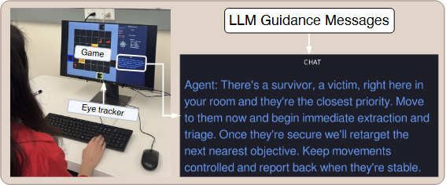{fig-alt="Annotated photo of a participant at the game and eye-tracker setup, with an example LLM guidance chat message shown alongside" width="60%"}
:::

---

## LLM Guidance Improved [Performance]{.accent}

<style>
.reveal #llm-guidance-improved-performance table th:nth-child(n+3) {
  text-transform: none;
}
</style>

| Outcome | Effect | β | q |
|---|---:|---:|---:|
| **Victims per step** | **LLM** | **0.020** | **< .01** |
|  | Expertise | 0.016 | ns |
|  | LLM × Expertise | −0.009 | ns |
| **Total rewards** | **LLM** | **267.143** | **< .01** |
|  | Expertise | −17.714 | ns |
|  | LLM × Expertise | 181.857 | ns |
| **Saved victims** | LLM | 0.035 | ns |
|  | Expertise | 0.221 | ns |
|  | LLM × Expertise | 0.435 | ns |

---

## LLM Guidance Changed [Visual Behavior]{.accent}

<style>
.reveal .compact-results table {
  width: 100%;
  font-size: 21px;
  line-height: 1.15;
}
.reveal .compact-results table td,
.reveal .compact-results table th {
  padding: 0.12em 0.8em;
}
.reveal .compact-results table tbody tr:not(:nth-child(3n)),
.reveal .compact-results table tbody tr:not(:nth-child(3n)) td {
  border-bottom: none;
}
.reveal .compact-results table th {
  text-transform: none;
}
.compact-results table td:first-child {
  white-space: nowrap;
}
</style>

::: {.compact-results}

| Outcome | Effect | β | q |
|---|---|---:|---:|
| **Fixation duration** | **LLM** | **−19.326** | **< .01** |
|  | Expertise | −26.475 | ns |
|  | LLM × Expertise | 17.059 | ns |
| **Pupil-size SD** | **LLM** | **0.122** | **< .0001** |
|  | Expertise | −0.042 | ns |
|  | **LLM × Expertise** | **−0.051** | **< .05** |
| **Game-area fixation** | **LLM** | **−0.184** | **< .0001** |
|  | Expertise | −0.015 | ns |
|  | **LLM × Expertise** | **0.114** | **< .01** |
| **Chat-area fixation** | **LLM** | **0.092** | **< .0001** |
|  | Expertise | 0.003 | ns |
|  | LLM × Expertise | −0.045 | ns |
| **Fixation count** | LLM | 0.248 | ns |
|  | Expertise | −0.201 | ns |
|  | **LLM × Expertise** | **0.815** | **< .05** |
| **Saccade count** | LLM | 0.234 | ns |
|  | Expertise | −0.482 | ns |
|  | **LLM × Expertise** | **0.961** | **< .01** |

:::

---

## [Results]{.accent} {#reported-effects .effects-slide}

<style>
.reveal .effects-slide > .panel-tabset > .panel-tabset-tabby { font-size: 0.75em; font-weight: 700; }
.reveal .effects-slide .tab-content .panel-tabset-tabby { font-size: 0.5em; margin-top: 0.3em; }
.reveal .effects-slide img { margin: 0.2em 0 0 0; box-shadow: none; border-radius: 0; }
</style>

::: {.panel-tabset}

### Performance

::: {.panel-tabset}

#### Victims per step

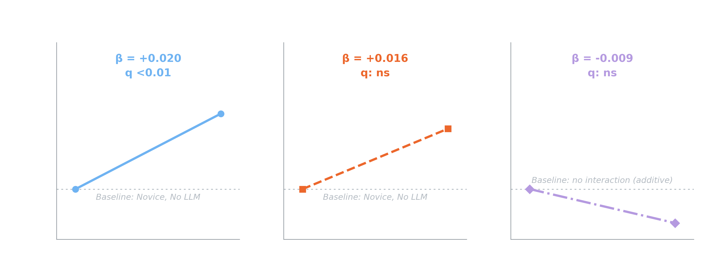{.nostretch fig-alt="Slope plots of the reported LLM, Expertise and LLM × Expertise coefficients for victims per step" width="100%"}

#### Total rewards

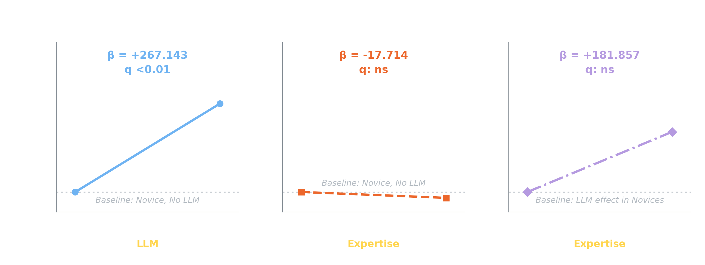{.nostretch fig-alt="Slope plots of the reported LLM, Expertise and LLM × Expertise coefficients for total rewards" width="100%"}

#### Saved victims

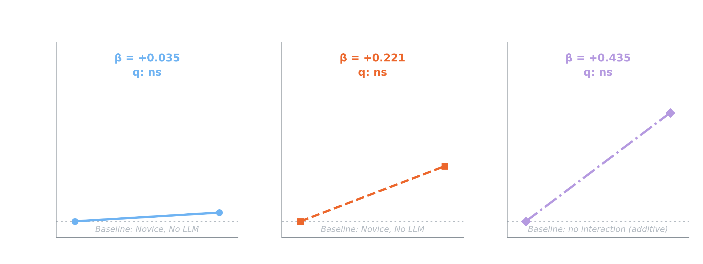{.nostretch fig-alt="Slope plots of the reported LLM, Expertise and LLM × Expertise coefficients for saved victims" width="100%"}

:::

### Eye features

::: {.panel-tabset}

#### Fixation duration

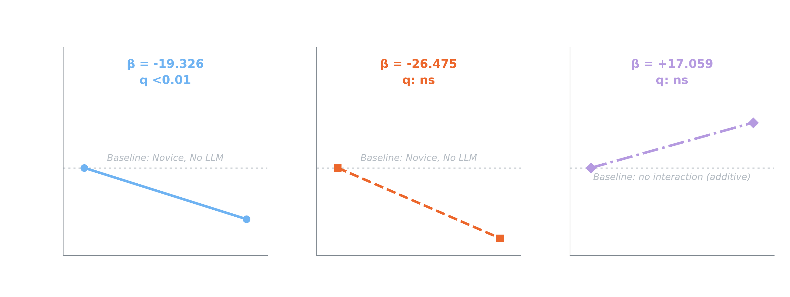{.nostretch fig-alt="Slope plots of the reported LLM, Expertise and LLM × Expertise coefficients for fixation duration" width="100%"}

#### Pupil-size SD

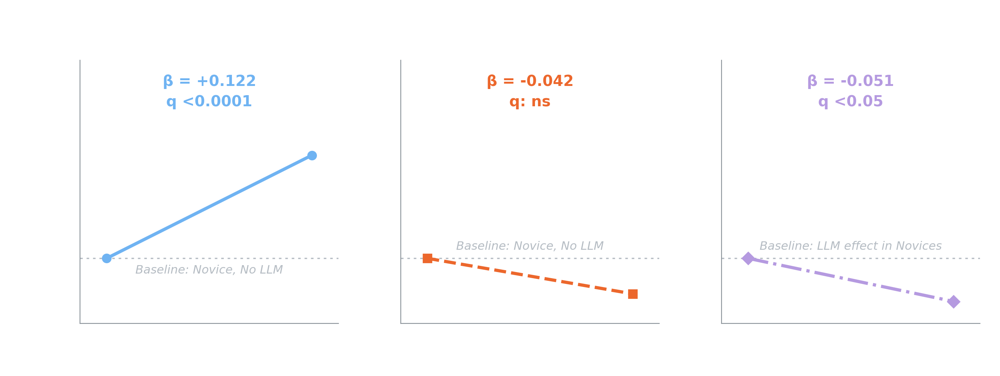{.nostretch fig-alt="Slope plots of the reported LLM, Expertise and LLM × Expertise coefficients for pupil-size sd" width="100%"}

#### Game-area fixation

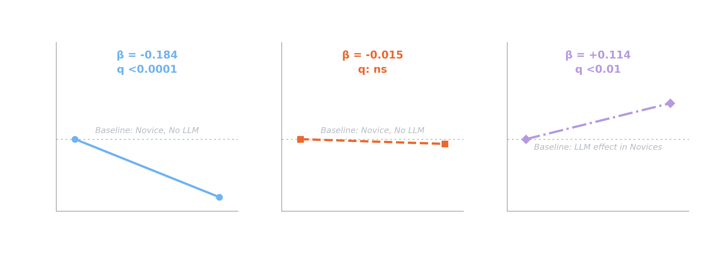{.nostretch fig-alt="Slope plots of the reported LLM, Expertise and LLM × Expertise coefficients for game-area fixation" width="100%"}

#### Chat-area fixation

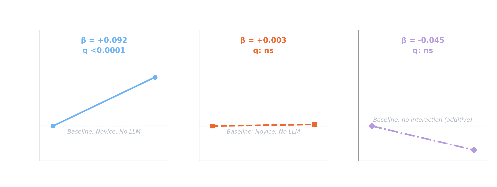{.nostretch fig-alt="Slope plots of the reported LLM, Expertise and LLM × Expertise coefficients for chat-area fixation" width="100%"}

#### Fixation count

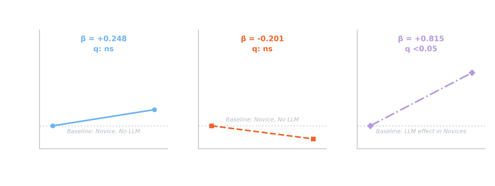{.nostretch fig-alt="Slope plots of the reported LLM, Expertise and LLM × Expertise coefficients for fixation count" width="100%"}

#### Saccade count

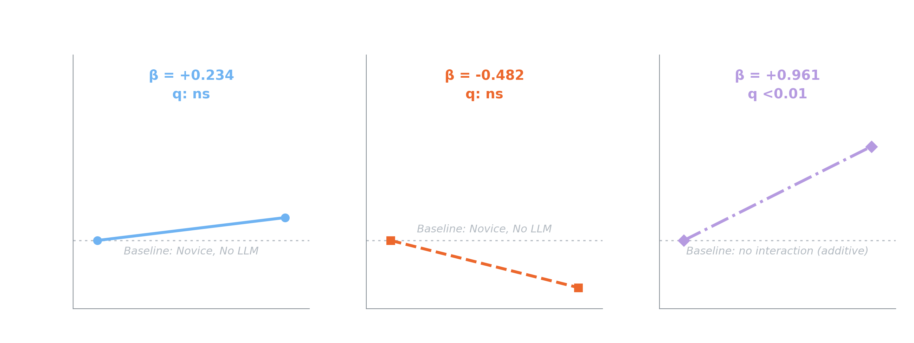{.nostretch fig-alt="Slope plots of the reported LLM, Expertise and LLM × Expertise coefficients for saccade count" width="100%"}

:::

:::

---

## Expertise Changes [How Guidance Is Used]{.accent}

::: {.cards}
::: {.card}
[Experts]{.card-title}

Maintained more engagement with the game under LLM support and showed stronger changes in visual scanning.
:::
::: {.card .secondary}
[Novices]{.card-title}

Shifted more attention away from the game, consistent with greater reliance on the guidance panel.
:::
:::

::: {.flow-diagram}
::: {.flow-step}
**LLM guidance received**
:::
::: {.flow-arrow}
↓
:::
::: {.flow-branch}
::: {.flow-step}
**Expert**

Cross-checks guidance against the environment (scans, verifies)
:::
::: {.flow-step .secondary}
**Novice**

Follows guidance directly
:::
:::
:::

---

## Limitations and [Future Work]{.accent}

::: {.columns}
::: {.column width="34%"}

### Limitations

- Sample size
- Simulated grid-world task

:::
::: {.column width="66%"}

### Future work

::: {.cards .grid-2}
::: {.card}
[Trust & reliability]{.card-title}
Test how LLM errors affect operator responses and trust.
:::
::: {.card}
[Adaptive guidance]{.card-title}
Tailor help using performance and physiological signals to reduce mental workload.
:::
::: {.card}
[Situation awareness]{.card-title}
Use this data to infer workload, situational awareness, and human–AI interaction patterns.
:::
::: {.card .secondary}
[Other domains]{.card-title}
Apply this approach to other human–AI teaming domains beyond search and rescue.
:::
:::

:::
:::

::: {.punchline}
The next step is moving from **static guidance** toward **reliable, adaptive human–AI teaming**.
:::

---

## {background-image="assets/background.jpg" background-opacity="0.45"}

::: {style="display:flex; flex-direction:column; align-items:center; justify-content:center; height:80vh; text-align:center;"}

{style="max-height:110px; border-radius:0 !important; box-shadow:none !important;"}

::: {style="font-size:2.8rem; font-weight:900; color:#ffffff; margin-top:0.8rem;"}
Thank you
:::

::: {style="font-size:1.5rem; color:#EC672C; margin-top:1.0rem; font-weight:700;"}
Questions?
:::

:::

---

## [References]{.accent} {id="references"}

::: {style="font-size:0.62em; line-height:1.5;"}
[1] Handler, Abram, Kai R. Larsen, and Richard Hackathorn. "Large language models present new questions for decision support." *International Journal of Information Management* 79 (2024): 102811.

[2] J. P. Distefano, H. Manjunatha, S. Chowdhury, K. Dantu, D. Doermann and E. T. Esfahani, "Using Physiological Information to Classify Task Difficulty in Human-Swarm Interaction," *2021 IEEE International Conference on Systems, Man, and Cybernetics (SMC)*, Melbourne, Australia, 2021, pp. 1198-1203, doi: [10.1109/SMC52423.2021.9658653](https://doi.org/10.1109/SMC52423.2021.9658653).

[3] Chevalier-Boisvert, M., Dai, B., Towers, M., Perez-Vicente, R., Willems, L., Lahlou, S., Pal, S., Castro, P. S., & Terry, J. (2023). Minigrid & Miniworld: Modular & Customizable Reinforcement Learning Environments for Goal-Oriented Tasks. *Advances in Neural Information Processing Systems (NeurIPS)*, 36.

[4] Siklóssy, Laurent, A. Rich, and Vesko Marinov. "Breadth-first search: some surprising results." *Artificial Intelligence* 4.1 (1973): 1-27.
:::
