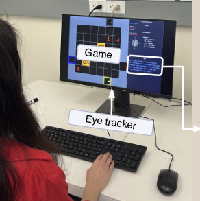

## Search and Rescue is a [time-critical]{.accent} human–AI setting

::: {.columns}
::: {.column width="47%"}

::: {.hook}
Operators must locate and recover people while conditions change quickly.
:::

- Missions occur in **challenging environments**
- Teams increasingly rely on **drones and digital decision aids**
- Decisions must be made under **time pressure**
- Guidance is useful only if it supports — rather than disrupts — attention

:::
::: {.column width="53%"}
{fig-alt="Drones supporting search-and-rescue operations" width="100%"}

:::
:::

---

## Research questions and [contribution]{.accent}

::: {.columns}
::: {.column width="62%"}

::: {.cards}
::: {.card}
[Performance]{.card-title}

Does LLM guidance improve task outcomes?
:::
::: {.card}
[Attention]{.card-title}

How does guidance change visual attention and eye-tracking metrics?
:::
::: {.card}
[Expertise]{.card-title}

Does expertise moderate these effects?
:::
::: {.card .secondary}
[Testbed]{.card-title}

Can a controlled simulation support repeatable human–AI teaming research?
:::
:::

::: {.punchline}
The study connects **task performance**, **visual behavior**, and **expertise** in one LLM-mediated SAR experiment.
:::

:::
::: {.column width="38%"}
{fig-alt="Participant using an eye tracker while playing the search-and-rescue game" width="100%"}
:::
:::

---

## Study design in [brief]{.accent}

::: {.columns}
::: {.column width="56%"}
{fig-alt="Search-and-rescue simulation interface with annotated game elements" width="100%"}
:::
::: {.column width="44%"}

::: {.stats}
::: {.stat}
[13]{.stat-number}
[Participants]{.stat-label}
:::
::: {.stat}
[3]{.stat-number}
[Trials each]{.stat-label}
:::
::: {.stat}
[2 + 1]{.stat-number}
[LLM + control]{.stat-label}
:::
::: {.stat}
[15 min]{.stat-number}
[or 1,000 moves]{.stat-label}
:::
:::

**Task:** rescue victims efficiently in a partially observable grid while victim health deteriorates.

**ALT** requests advice and reveals victim health for **5 seconds**.
:::
:::

---

## Demonstration [video]{.accent} 1

<video controls width="90%" style="display:block; margin:auto; max-height:70vh;">
  <source src="assets/Mediaa.mp4" type="video/mp4">
</video>

---

## Demonstration [video]{.accent} 2

::: {.columns}
::: {.column width="65%"}

<video controls width="100%" style="display:block; margin:auto; max-height:480px;">
  <source src="assets/Media1%20(1).mp4" type="video/mp4">
</video>

:::
::: {.column width="32%"}
{fig-alt="Grid of black T-shaped symbols in different orientations on a gray background" width="100%"}
:::
:::

---

## How the LLM was [prompted]{.accent} {.prompt-slide}

::: {.llm-message}
You are a search-and-rescue coordinator giving calm, human-like radio guidance to the operator. Follow mission and environment rules: rescue all survivors, prioritize visible reachable survivors who are still saveable, nearest first, use matching keys for locked doors, unlocked doors can be opened, carry only one key, avoid lava, and never mention unreachable objects. Instructions must be directional and action-focused, always using North, South, East, West, with no coordinates, step counts, or visible reasoning. From the current state {obs}, choose one immediate objective by prioritizing the nearest reachable visible saveable survivor, then the next saveable survivor if relevant; otherwise choose the best remaining alive victim, then the nearest reachable survivor or key, or finally explore visible areas that may open a new path. Output either a sparse one-sentence instruction or a detailed 3–4 sentence radio briefing, always concise, natural, rule-compliant, and wrapped strictly as \<START\> ... \<END\>.
:::

- **Grid-based world:** each cell represents an object such as empty space, wall, victim, lava, door, or key.
- **Reachability check:** BFS determines which targets are reachable and their distance from the player.
- Models: **OpenAI** and **Gemini**.

::: {.cards}
::: {.card}
[Guidance style]{.card-title}
Short, calm, action-focused guidance.
:::
::: {.card}
[Priority]{.card-title}
Reachable survivors first.
:::
::: {.card}
[Mission rules]{.card-title}
Avoid lava, use keys, open doors.
:::
:::

---

## Eye-tracking [features]{.accent}

::: {.columns}
::: {.column width="58%"}
| Feature | What it shows |
|---|---|
| Fixation count | How often the participant focused on an area |
| Fixation duration | How long the participant looked at one area |
| Saccade duration | Duration of fast eye movements |
| Pupil diameter SD | Variation in pupil size, related to workload |
| Game-area fixation time | Attention to the SAR environment |
| Chat-panel fixation time | Attention to the LLM guidance |
| AOI transitions | Switching gaze between game and chat |
:::
::: {.column width="42%"}
{fig-alt="Participant playing the SAR game while a Tobii eye tracker records gaze" width="100%"}
:::
:::

::: {.punchline}
:::

---

## Measures and [analysis]{.accent}

::: {.columns}
::: {.column width="50%"}

### Outcomes

- **Task:** victims per step, total rewards, saved victims
- **Visual attention:** game/chat fixation allocation, fixation duration, pupil-size SD, fixation and saccade counts

:::
::: {.column width="50%"}

::: {.stats}
::: {.stat}
[13]{.stat-number}
[Participants]{.stat-label}
:::
::: {.stat}
[3]{.stat-number}
[Randomized trials]{.stat-label}
:::
::: {.stat}
[60 Hz]{.stat-number}
[Eye-tracker rate]{.stat-label}
:::
::: {.stat}
[K = 2]{.stat-number}
[Expertise clusters]{.stat-label}
:::
:::

:::
:::

**Mixed-effects model:** outcome = LLM condition + LLM × expertise + expertise + participant random intercept.

---

## LLM guidance improved [performance]{.accent}

| Outcome | Effect | β | SE | q |
|---|---:|---:|---:|---:|
| **Victims per step** | **LLM** | **0.020** | 0.006 | **< .01** |
|  | Expertise | 0.016 | 0.013 | ns |
|  | LLM × Expertise | −0.009 | 0.010 | ns |
| **Total rewards** | **LLM** | **267.143** | 90.203 | **< .01** |
|  | Expertise | −17.714 | 135.183 | ns |
|  | LLM × Expertise | 181.857 | 139.742 | ns |
| **Saved victims** | LLM | 0.035 | 0.206 | ns |
|  | Expertise | 0.221 | 0.436 | ns |
|  | LLM × Expertise | 0.435 | 0.320 | ns |

---

## LLM guidance changed [visual behavior]{.accent}

::: {.compact-results}

| Outcome | Effect | β | SE | q |
|---|---:|---:|---:|---:|
| **Mean fixation** | **LLM** | **−19.326** | 6.216 | **< .01** |
| **Pupil-size SD** | **LLM** | **+0.122** | 0.014 | **< .0001** |
|  | **LLM × Expertise** | **−0.051** | 0.021 | **< .05** |
| **Game-area** | **LLM** | **−0.184** | 0.023 | **< .0001** |
|  | **LLM × Expertise** | **+0.114** | 0.035 | **< .01** |
| **Chat-area** | **LLM** | **+0.092** | 0.016 | **< .0001** |
| **Fixation count** | **LLM × Expertise** | **+0.815** | 0.342 | **< .05** |
| **Saccade count** | **LLM × Expertise** | **+0.961** | 0.325 | **< .01** |

:::

---

## Expertise changes [how guidance is used]{.accent}

::: {.cards}
::: {.card}
[Experts]{.card-title}

Maintained more engagement with the game under LLM support and showed stronger changes in visual scanning.
:::
::: {.card .secondary}
[Novices]{.card-title}

Shifted more attention away from the game, consistent with greater reliance on the guidance panel.
:::
:::

::: {.punchline}
A plausible interpretation is that experts **cross-check the advice against the environment**, rather than simply following it.
:::

::: {.flow-diagram}
::: {.flow-step}
**LLM guidance received**
:::
::: {.flow-arrow}
↓
:::
::: {.flow-branch}
::: {.flow-step}
**Expert**

Cross-checks guidance against the environment (scans, verifies)
:::
::: {.flow-step .secondary}
**Novice**

Follows guidance directly
:::
:::
:::

---

## LLM guidance [redirects attention]{.accent}

::: {.metric-grid}
::: {.metric}
[−0.184]{.value .accent}

[Game-area fixation]{.label}

[Less fixation allocation · 95% CI: −0.229 to −0.139 · q < .0001]{.detail}
:::
::: {.metric}
[+0.092]{.value .accent}

[Chat-area fixation]{.label}

[More fixation allocation · 95% CI: 0.061 to 0.123 · q < .0001]{.detail}
:::
::: {.metric}
[−19.33 ms]{.value .accent}

[Mean fixation duration]{.label}

[Shorter fixations · 95% CI: −31.509 to −7.143 · q < .01]{.detail}
:::
::: {.metric}
[+0.122]{.value .accent}

[Pupil-size SD]{.label}

[Greater pupil variability · 95% CI: 0.095 to 0.149 · q < .0001]{.detail}
:::
:::

::: {.punchline}
LLM support did not only change **where** participants looked; it also changed **how** they visually processed the task.
:::

---

## Expertise [moderates visual behavior]{.accent}

| Measure | LLM × expertise β | 95% CI | q |
|---|---:|---:|---:|
| **Game-area fixation** | **+0.114** | 0.045 to 0.183 | **< .01** |
| **Fixation count** | **+0.815** | 0.145 to 1.485 | **< .05** |
| **Saccade count** | **+0.961** | 0.324 to 1.598 | **< .01** |
| **Pupil-size SD** | **−0.051** | −0.092 to −0.010 | **< .05** |

::: {.punchline}
Experts showed a **smaller shift away from the game** and stronger changes in visual activity under LLM support.
:::

---

## Limitations and [future work]{.accent}

::: {.columns}
::: {.column width="34%"}

### Limitations

- Small sample
- Task-based expertise classification
- Simulated grid-world task
- Behavior may differ from real SAR operations

:::
::: {.column width="66%"}

### Future work

::: {.cards}
::: {.card}
[Trust & reliability]{.card-title}
Test how LLM errors affect operator responses and trust.
:::
::: {.card}
[Adaptive guidance]{.card-title}
Tailor help using performance and body signals to reduce mental workload.
:::
::: {.card}
[Situation awareness]{.card-title}
Measure awareness of nearby hazards and the overall mission during LLM-guided decisions.
:::
::: {.card .secondary}
[Generalization]{.card-title}
Test larger samples and more realistic SAR scenarios.
:::
:::

:::
:::

::: {.punchline}
The next step is moving from **static guidance** toward **reliable, adaptive human–AI teaming**.
:::

---

## {background-image="assets/background.jpg" background-opacity="0.45"}

::: {style="display:flex; flex-direction:column; align-items:center; justify-content:center; height:80vh; text-align:center;"}

{style="max-height:110px; border-radius:0 !important; box-shadow:none !important;"}

::: {style="font-size:2.8rem; font-weight:900; color:#ffffff; margin-top:0.8rem;"}
Thank you
:::

::: {style="font-size:1.5rem; color:#EC672C; margin-top:1.0rem; font-weight:700;"}
Questions?
:::

:::
